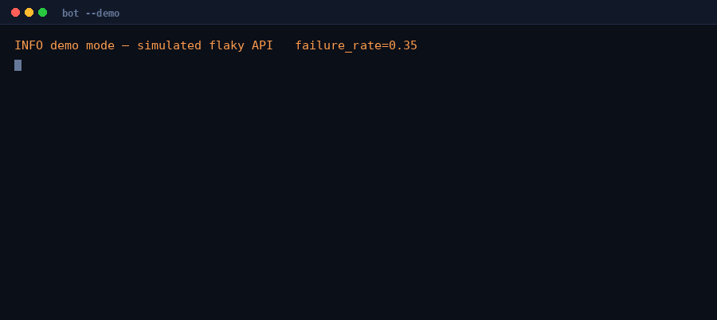

# Resilient Telegram Bot

A Telegram/Discord-style bot skeleton built around the part most tutorials skip:
**what happens when the API doesn't answer.**

Most bots work in the demo and die on the first timeout. The process exits, and
nobody notices for a week because nothing was watching. This one retries with
backoff, logs what happened, survives outages longer than its own retry budget,
and comes back after a reboot.



```bash
pip install -r requirements.txt
python -m bot.main --demo
```

That recording is real output: two calls in five failed, three retries, zero
messages lost, process never exited.

**No token needed.** `--demo` runs against a deliberately unreliable fake API so
you can watch the recovery behaviour on your own machine, right now.

## What that looks like

Real output from `python -m bot.main --demo --failure-rate 0.4`:

```
WARN transient failure, retrying   label=sendMessage  attempt=1  of=5  wait_s=0.17  error=connection reset by peer
INFO sent                          chat=4242  text=resilience is just error handling you bothered to write
INFO recovered                     label=sendMessage  attempt=2
WARN transient failure, retrying   label=getUpdates   attempt=1  of=5  wait_s=0.31  error=timeout
WARN transient failure, retrying   label=getUpdates   attempt=2  of=5  wait_s=0.36  error=HTTP 502 Bad Gateway
INFO recovered                     label=getUpdates   attempt=3
INFO bot stopped                   calls=24  retries=8  recovered=6  failures=0
```

Two in five calls failed. Zero messages were lost, and the process never exited.

## The design decisions worth arguing about

**Transient and permanent failures are different things.** A 502 or a timeout is
worth retrying. A 401 means your token is wrong, and retrying it five times just
makes the log noisier. They're separate exception types and only one gets retried.

**Backoff uses full jitter.** Without jitter every retry lands in the same
instant, so the service that just failed gets a synchronised stampede the moment
it recovers. Delay is uniform in `[0, capped_delay]`, not the capped delay itself.

**Exhausting retries does not kill the bot.** If an outage outlasts the retry
budget, the cycle is logged as failed and the loop continues. An API down for
ten minutes shouldn't require a human to restart anything.

**A permanent error does exit, non-zero.** Restart-looping forever against a
revoked token is worse than stopping loudly.

**Handlers can't take the process down.** A bug in one command replies with the
error and keeps the bot up.

**SIGTERM is caught**, so systemd restarts finish the current message instead of
cutting it in half.

**Logs carry structured fields**, not interpolated prose — `label`, `attempt`,
`wait_s`, `error`. Human-readable on a terminal, `--json-logs` when something
needs to parse them.

## Commands

| Command | Does |
|---|---|
| `/start` | hello |
| `/help` | list commands |
| `/status` | uptime, call/retry/recovery/failure counters |
| `/echo <text>` | echoes back |

Adding one is a decorator, with no edit to the loop:

```python
@command("/price", "current BTC price")
def price(ctx: Context) -> str:
    return fetch_price()
```

## Running it for real

```bash
export BOT_TOKEN="123456:ABC..."
python -m bot.main
```

For a server, [`deploy/telegram-bot.service`](deploy/telegram-bot.service) is a
systemd unit with the things people forget: `Restart=always` **rate-limited** so
a bad token can't become an infinite crash loop, the token in an
`EnvironmentFile` rather than the unit, `SIGTERM` for clean stops, and a
locked-down sandbox — it polls an HTTPS API and writes logs, so it gets nothing
else.

```bash
sudo systemctl enable --now telegram-bot
journalctl -u telegram-bot -f
```

## Layout

```
bot/
  resilience.py     retry, backoff, failure accounting
  client.py         Telegram API client + the flaky demo client
  handlers.py       command registry and dispatch
  logging_setup.py  console and JSON formatters
  main.py           polling loop, signals, CLI
deploy/
  telegram-bot.service
tests/              15 tests
```

## Tests

```bash
python -m pytest tests/ -q
```

```
...............                    [100%]
15 passed in 0.06s
```

They cover the parts where being wrong is expensive: that permanent errors are
*not* retried, that backoff is exponential and capped, that jitter stays in
bounds and actually varies, that exhausted retries keep the loop alive, and that
a raising handler doesn't propagate.

One test documents what is deliberately *not* guaranteed: at a 50% failure rate
with 6 attempts, an occasional fully-exhausted retry is expected maths, not a
bug. The guarantee is that the loop absorbs it.

## Discord

The structure ports directly — swap `client.py` for a Discord gateway client and
the resilience, handler and logging layers are unchanged. That separation is
deliberate.

## License

MIT
